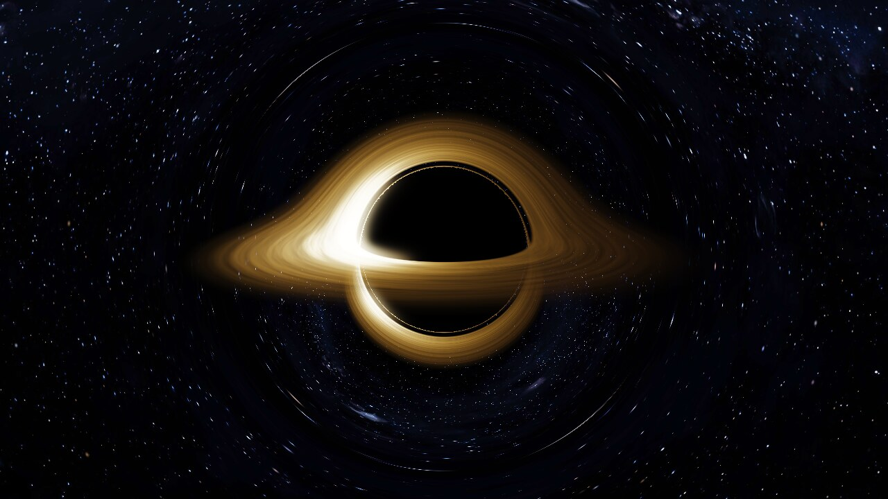
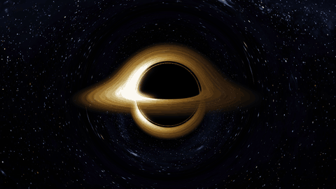
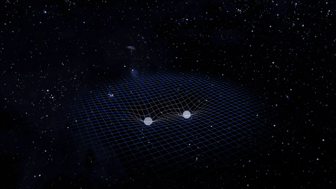
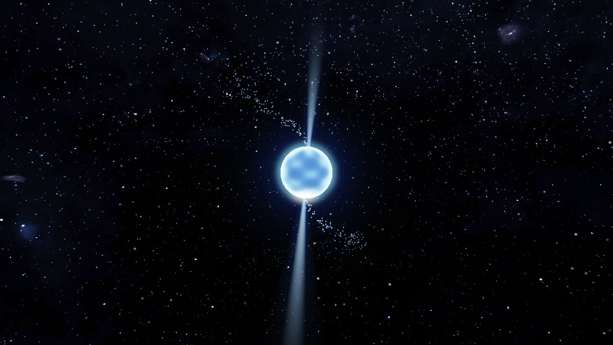
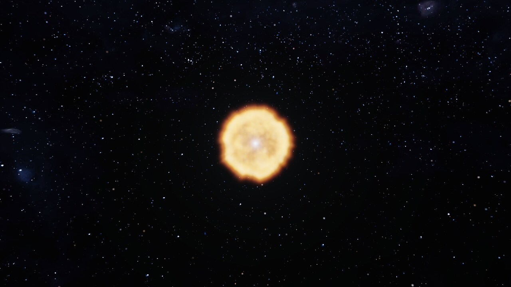
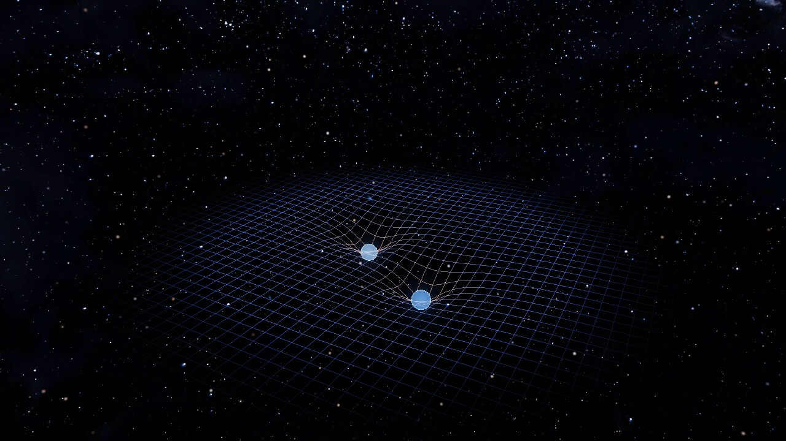
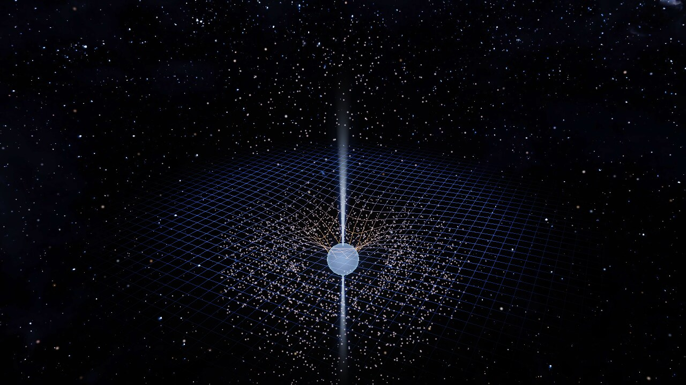
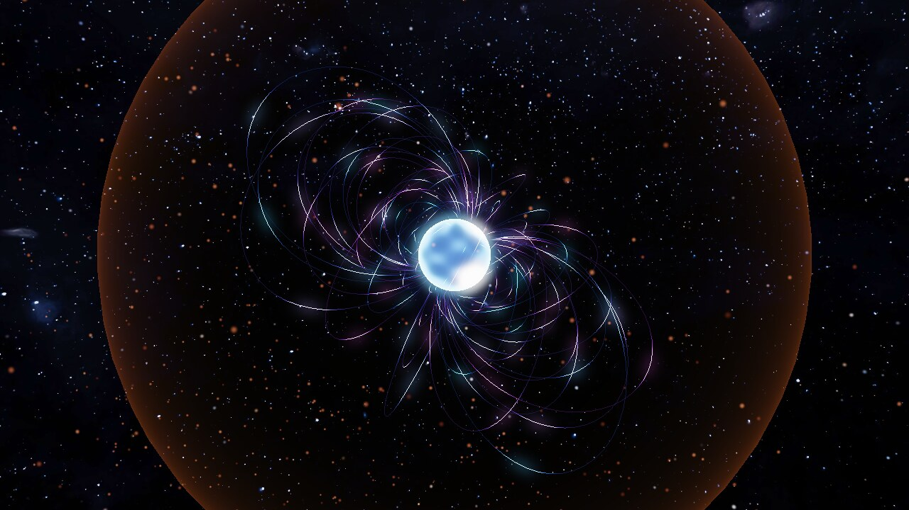

# Space Event Simulator

[](https://github.com/Danielpm2/opengl/actions/workflows/build.yml)
[](LICENSE)

Watch the universe's most violent events happen in real time. A small OpenGL 3.3 core / C++17 app with five interactive simulations: orbit the camera, tweak the physics with sliders, and watch what changes.



## In motion

| Black hole: the disk rotates while the camera orbits | Neutron star merger: inspiral, flash, jets |
| --- | --- |
|  |  |

## The simulations

### Black Hole
A fragment-shader raymarcher bends light rays through a Schwarzschild field, so the glowing accretion disk appears wrapped over and under the hole. The approaching side of the disk is Doppler-beamed brighter, and the real Milky Way behind it is lensed too.

### Pulsar
A neutron star spins with its magnetic axis tilted away from the rotation axis. Two radiation beams sweep around like a lighthouse, and the whole screen flares when one points at you.



### Supernova
A massive star swells, then collapses. A blinding flash at core bounce launches a clumpy, volumetric shock shell that expands and fades before the cycle loops.



### Neutron Star Merger
Two neutron stars spiral together on a curved spacetime grid that carries gravitational-wave ripples. Then comes the merger flash, relativistic jets and a kilonova cloud.

| Inspiral | Aftermath |
| --- | --- |
|  |  |

### Magnetar
Twisted dipole field lines build up stress until a starquake releases it as a giant flare.



The math behind each event is listed with sources in [docs/REFERENCES.md](docs/REFERENCES.md).

## How accurate is it?

This is a visualization, not a research code. Some parts follow real physics; others are there to look good. Times are also compressed so events fit in seconds.

| Simulation | Physically grounded | Stylized |
| --- | --- | --- |
| Black Hole | Light rays are integrated through a Schwarzschild field (photon orbit equation). Kerr horizon and ISCO radii in closed form. Doppler beaming and gravitational redshift on the disk. Disk temperature falls as $r^{-3/4}$. | Spin only changes the horizon, ISCO and disk rotation, so frame dragging is not simulated. The disk is an infinitely thin plane with noise for turbulence. The colour ramp and brightness exponent are tuned by eye. |
| Pulsar | Lighthouse geometry: a magnetic axis tilted from the spin axis, two beams, a pulse seen only when a beam crosses the line of sight. | Particles fly straight out instead of following field lines. Beam shape is a Gaussian cone. The default spin of 0.5 rev/s is far slower than most real pulsars. |
| Supernova | The collapse, bounce, flash and expanding blast-wave sequence, and a blast radius that grows as a power law in time. | The exponent and energy dependence are tuned, not Sedov-Taylor exact. Shell clumps, thickness and brightness decay are artistic. There is no hydrodynamics. |
| Neutron Star Merger | Kepler orbit and the $\dot a \propto -1/a^3$ shape of gravitational-wave decay. Ripples at twice the orbital frequency. | The decay rate is tuned to take about 16 s. The spacetime grid uses a softened $-m/r$ well, not a solution of Einstein's equations. The kilonova cloud, jets and tidal stretching are visual effects. |
| Magnetar | Dipole field line geometry, $r = L\sin^2\theta$. | Twist build-up, the starquake and the flare are scripted, not simulated. |

See [docs/REFERENCES.md](docs/REFERENCES.md) for the sources.

## Build (Linux)

Requirements: CMake >= 3.20, a C++17 compiler, git, network access (GLFW, GLM and Dear ImGui are fetched by CMake), and X11 development packages for GLFW.

```sh
# Debian / Ubuntu / Pop!_OS
sudo apt install build-essential cmake git libgl1-mesa-dev \
    libx11-dev libxrandr-dev libxinerama-dev libxcursor-dev libxi-dev

cmake -S . -B build
cmake --build build -j
./build/spacesim
```

GLFW's Wayland backend is built only if `libwayland-dev`, `libxkbcommon-dev`, `wayland-protocols` and `wayland-scanner` are installed; otherwise the X11 backend is used (XWayland on Wayland sessions).

Options: `./build/spacesim --sim pulsar` (or `"black hole"`, `supernova`, `"neutron star merger"`, `magnetar`) skips the menu.
Dev aids: `--warp <seconds>` fast-forwards the simulation, `--screenshot <file.ppm>` saves a frame and exits, and `--no-ui` hides all interface elements. `--record <prefix> <frames>` writes numbered PPM frames at a fixed 30 fps and exits, and `--orbit <rad/s>` turns the camera. The images and GIFs in `docs/images/` were made with these, e.g. `ffmpeg -framerate 30 -i prefix_%04d.ppm out.gif`.

## Tests

The simulation core has no OpenGL dependency, so its tests need no window or GPU:

```sh
cmake --build build -j
ctest --test-dir build --output-on-failure
```

They check the black hole against the Kerr horizon and ISCO values, the camera clamps, the pulsar beam geometry, the supernova and merger timelines (including looping), magnetar field lines and flares, and that every slider starts in range. GitHub Actions builds the project and runs them on every push.

## Controls

| Input | Action |
| --- | --- |
| Left-drag, arrow keys | Orbit camera |
| Scroll, W / S | Zoom |
| Sliders (top-left panel) | Change simulation parameters |
| Esc | Back to menu (quit from the menu) |
| F11 | Toggle fullscreen |
| Space | Pause / resume |
| H | Hide / show the interface |
| F1 | Controls help overlay |
| 1-5 (menu) | Launch a simulation |
| B | Toggle bloom (settings under "Post-processing" in the panel) |

## Layout

```
src/core/     simulation state, physics, camera math (GLM only; no OpenGL/ImGui)
src/render/   window, shader loader, renderers, ImGui UI, registry
shaders/      .glsl files loaded at runtime (copied next to the binary on build)
assets/       images loaded at runtime via stb_image (Milky Way sky map; see assets/CREDITS.txt)
external/     vendored GLAD OpenGL loader
tests/        unit tests for src/core (run with ctest)
docs/         references and README images
```

The app requests an OpenGL 3.3 core context and only calls 3.3 functions, so it runs on older GPUs. The vendored GLAD loader was generated for 4.6 simply because it is a superset: it loads whatever the driver offers, and the extra entry points are never used.

## Adding a simulation

1. Add a class deriving `core::Simulation` in `src/core/` and list it in `sim_core` in `CMakeLists.txt`.
2. Add a `render::SimRenderer` subclass in `src/render/` and its shaders in `shaders/`.
3. Add one entry to `registry()` in `src/render/registry.cpp`.

## License

The code is released under the [MIT License](LICENSE). The sky map and fonts in `assets/` have their own licenses; see [assets/CREDITS.txt](assets/CREDITS.txt).
